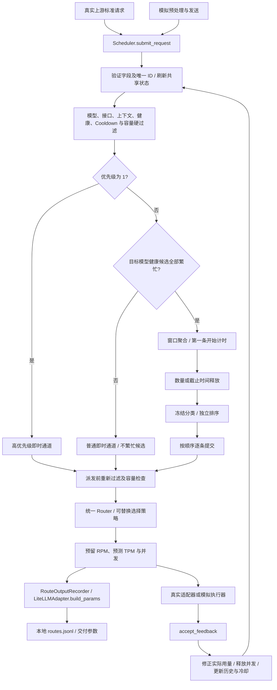

# 架构与运行流程

[项目首页](../README.md) · [使用指南](guide.md) · [开发接口](development.md)

## 模块边界与输入输出

| 模块 | 输入 | 输出与职责 |
| --- | --- | --- |
| simulation.source / data_processing | 原始记录、模拟参数 | 标准请求与独立的实际长度观测；计数、估计、优先级、SLO |
| simulation.request_sender | 请求序列、发送参数 | fixed/random/burst 到达时刻；调用 submit_request |
| core.request | 上游标准字段 | SchedulerRequest、SLO、RequestBatch、RouteDecision、ExecutionResult |
| core.endpoint_state | 静态端点、预留、反馈、时间 | 唯一共享的 RPM/TPM/并发/健康/Cooldown 状态 |
| core.endpoint_filter | 请求、端点、当前状态 | 兼容池、健康候选池、硬容量可行池、排除原因 |
| core.busy_detector | 目标模型健康候选及阈值 | 繁忙原因、池是否全部繁忙、不繁忙端点 ID |
| core.admission | 优先级、负载 | 高优先级即时、普通即时或窗口路径及端点范围 |
| core.batch_window | 普通繁忙请求、数量/等待上限 | RequestBatch；只聚合，不排序 |
| policies.ranking | 已释放请求、策略参数和上下文 | 完整且唯一的请求顺序；独立于窗口与路由 |
| core.request_dispatcher | 即时请求、窗口排序结果 | 按通道顺序逐条尝试提交 |
| core.router / policies.routing | 单请求、候选、价格、历史 | RouteDecision；三个通道共享入口 |
| core.endpoint_history | 执行反馈、窗口参数 | 近期成功/失败数和平均 E2E/TTFT/TPOT |
| adapters.litellm_adapter | 路由决定、部署绑定、注入的调用函数 | LiteLLM 参数或执行反馈 |
| core.scheduler | 请求、时钟推进、反馈 | 编排模块、调度记录、派发结果及事件 |
| simulation.execution / engine | 实际长度、服务参数 | 虚拟完成事件，回送 accept_feedback |
| adapters.route_output | 已派发 RouteDecision、所选 EndpointConfig | 按实际派发顺序写入 LiteLLM 交付 JSONL；成功后原子替换 |

核心不依赖 tokenizer、原始数据格式、虚拟流量和模拟服务模型。真实接入直接创建 SchedulerRequest，已有长度和预测不重新计算。普通 token 分类的核心导入只需标准库；选择百分位策略时才加载已有参考相关依赖。

## 请求到来的完整流程

1. 验证 ID、模型、非负整数长度、0/1 优先级、毫秒时间、消息和可选 SLO。保存调度器自己的副本；接收入口不执行 tokenization。
2. 清理 `(t−60000,t]` 之外的额度和到期冷却。过滤产生三个集合：`compatible` 满足模型/接口/上下文及扩展能力规则；`eligible` 再满足健康/Cooldown；`feasible` 再满足实际硬容量。
3. 无兼容端点时明确拒绝。暂时无健康候选或容量不足时等待恢复。空健康池不视为“全部繁忙”，普通请求进入即时等待通道；行政健康恢复需外部观测更新状态并调用 tick，冷却到期由时间事件唤醒。
4. 高优先级走即时通道；普通请求针对自己的目标模型健康池判断繁忙。单端点任一利用率达到软阈值即繁忙，池内全部繁忙才入窗。**容量已满的端点仍保留在 eligible 内参与判断**，不会因 feasible 为空把拥塞误判为空闲。
5. 普通非繁忙请求仅选择不繁忙端点。窗口从第一条请求开始计时，后来成员不重置截止时间；达到 max_batch_size 或 max_wait_ms 即释放。模拟 EOF 另行释放不足一批的窗口，真实请求不依赖 EOF。
6. 分类在即时到达或窗口释放时冻结；排序只调用一次。默认保持旧算法，可选 weighted_length 按输入和预测输出加权。计划冻结后不随状态变化重新排序。
7. 恢复时先尝试高优先级，再普通即时，最后窗口队列。即时通道跳过暂不可派发的请求；窗口队首不可执行时，后续窗口请求等待。顺序提交允许并发执行，不要求前一条完成。
8. 每条派发前重新过滤。普通即时通道还筛选当前不繁忙端点；高优先级与窗口通道使用全部健康可行候选。Router 接收单请求、价格、当前快照和近期缓存，再调用独立选择策略。
9. 选择有效端点后预留额度。调用方通过 take_decisions 或 on_dispatch 获得决定，交给执行器。默认回放的 on_route 先调用 RouteOutputRecorder，用 LiteLLMAdapter 构建并记录交付参数，再计划模拟完成事件。路由算法不构建模型调用参数，不读取实际输出，不计算服务时间。
10. 完成/失败通过 accept_feedback 回送，释放并发、修正实际 tokens、更新历史和失败状态，再尝试等待请求。重复、未知、端点或开始时间不匹配的反馈在变更资源前拒绝；迟到反馈不倒退时钟。

## 额度、冷却与历史

派发同时满足：`requests_in_window < rpm_limit`、`tokens_in_window + input_tokens + predicted_output_tokens <= tpm_limit`、`concurrency < concurrency_limit`。RPM 加 1；TPM 预留输入加预测输出；并发加 1。反馈释放并发，按已知实际输入/输出修正 TPM，未知项保留估计。额度按原派发时刻满 60 秒过期；迟到反馈不把已过期用量重新加入窗口。

实际输出可能大于预测，使反馈后的 TPM 超限；后续派发被阻止到额度恢复。估计预留不会在执行中截断输出。max_tokens 是调用输出上限和上下文校验依据，与预测值含义不同。

没有每分钟整点清零任务。到达、tick、反馈及快照读取均按时间清理；next_wakeup_ms 提供窗口截止、最早额度/冷却恢复时间。模拟引擎推进到这些时刻；真实网关需注册到自身定时器，并串行提交状态变更。核心不启动后台线程，也不提供多进程一致性存储。

Endpoint/rate_limit 失败进入 cooldown_ms；明显参数错误、取消、未知原因不自动冷却。healthy 为外部行政状态，独立于自动冷却。states.export 可在内存中读取用量、并发、健康、冷却和失败数。load_health_state 只恢复健康/冷却，不恢复历史配额或在途请求；带未结束执行的状态会被拒绝，不支持跨进程完整续跑。

历史保留 `(t−history_window_ms,t]` 的完成样本，每端点再限制 history_max_samples。完成时增量更新，过期/超量时扣除，路由读取均值而不重扫日志。迟到反馈按完成时间插入。成功样本用于延迟均值，失败用于失败数，未知指标保持 null。E2E 包含到达至完成的排队；适配器 TTFT 从执行调用开始至首次非空内容/工具输出；TPOT 按已知实际输出 token 数计算观测平均，流式分块不等于逐 token 精确测量。

## 模拟基线与分类

一物理行代表一次完整 prompt/response，历史 assistant 仅作上下文；消息、工具及控制字段按现有 tokenizer 计数。实际输出来自录制答案，由模拟执行器计算服务时间并反馈。默认 oracle 预测使用录制答案长度以保留旧基线；fixed 或上游显式预测可消除这一模拟先验，核心只看到预测值。

原四档只保留在模拟观测的 priority_level：4 映射核心 1，其余映射 0；默认模拟排序仍保留旧档位先后。二档模式按种子/request_id 固定哈希和 high_priority_ratio 生成；真实请求不经生成器。

服务时间保持原公式：`max(1, ceil((基础时延 + 实际输入/输入速度 + 实际输出/输出速度) × 波动倍率))`，波动按 seed/request_id/endpoint_id 固定哈希。模拟没有逐 token 事件，所以 TTFT/TPOT 为 null。

同一虚拟时刻先清理资源并处理完成，再依到达顺序尝试即时请求，最后处理窗口超时和剩余派发。min_rpm 选择请求数/RPM 上限最低端点，同分按配置顺序。CLI 默认回放 3168 条原始记录；调度明细、事件和汇总保留在 RunResult 内存中。

冻结参考来自 5186 个历史样本、754 个不同长度；右连续 ECDF 为长度≤x的频数/N，与当前 3168 条回放不是同一分母。pressure_rules 使用并发和已到达待执行请求决定分类门槛，不参与调度繁忙的 OR 与模型池 AND 判断。

Pareto 尚未实现。接入点为 select_endpoint(request, endpoints, context)，context 提供价格及近期 E2E/TTFT/TPOT，请求提供模型、流式标志和 SLO。默认 min_rpm 不使用成本或 SLO 打分。

## 输出边界

CLI 唯一写出的正式文件为 `results/routes.jsonl`，内容是实际派发的请求 ID、端点、时刻和 LiteLLM 参数。记录器在核心之外，不参与候选筛选、排序或状态维护；反馈保留在运行内存中。成功排空系统并验证输入未变后原子替换文件，失败保留上一份输出。固定参考 Parquet 与元数据仍是分类输入。

详细模块图：[Mermaid 源码](figures/Endpoint模块输入输出与数据流_修正版.txt) · [SVG](figures/Endpoint模块输入输出与数据流_修正版.svg) · [PNG](figures/Endpoint模块输入输出与数据流_修正版.png)。
